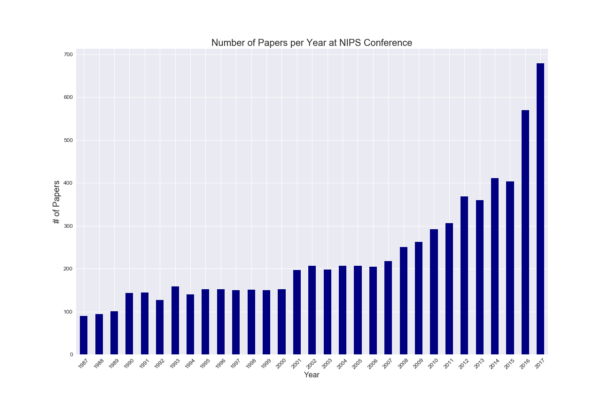

## Natural Language Processing NeurIPS Papers
The purpose this project is to do a topic based analysis of the content in papers submitted at an annual conference for  computational neuroscience (ie. neural networks,AI and related topics) known as  NeurIPS.  (see [https://en.wikipedia.org/wiki/Conference_on_Neural_Information_Processing_Systems]()). 

Over 7200 papers were obtained from Kaggle as CSV files. (see [here](https://www.kaggle.com/benhamner/nips-papers#papers.csv).  The papers were presented at NeurIPS between 1987 and 2017. The papers were explored via NLP techniques and Latent Dirichlet Allocation (LDA) models. LDA modeling is a form of probabilistic, unsupervised deep learning that reveals topics. The findings are presented in graphical and topic descriptions which show the importance certain terms have within these LDA topics. It's important to note that these topics are often not easily understood by humans (NLP research hopes to improve this issue). Rather, the findings allow for a better view into the data of interest: human language and it's meaning and how machines are beginning to tackle the notion of meaning in natural language.

## NeurIPS Data and EDA

The papers were read into a Pandas dataframe and early EDA completed. The data was quite clean, and no imputation necessary. Here is a plot showing the number of papers per yearly conference. 

In NLP, word clouds seem quite useful because analysts can  graphically see what words are most frequent. The topics for papers presented seem well represented in the titles of the papers. As part of EDA, a word cloud of the frequency of terms in the titles is here:

A new column was created from the papers' text called "text_processed" which stores the data after stop words were removed.  The following bar graph showing the most frequent terms in the overall corpus of papers taken together.

## Analyzing Time Periods

NLP modeling results require significant post-modeling analysis. Presentation of findings can be cumbersome because the findings are non-labeled topics found in quantitative ways. So, rather than analyzing each year's conference separately, a decision was made to analyze and present topics per decade of papers. The findings from each of the 1980s, the 1990s, the 2000s and the 2010's are presented using LDA modeling. The LDA topics can be viewed by coefficients that represent how important that term is in the formation of that un-labeled topic. For example, the following output from LDA:

  
can be understood as showing topics 0 and 1. Within topic 0, the term "kernel" has a coefficient 0.105 and the next term "estimator" has a coefficient 0.086. These are the two most important terms in topic 0. Note that the values are best read as relative strengths. 
  
# Measuring The Coherence Values in LDA Models

The common understanding of the modeling term "coherent" applies. It means the terms within the LDA topic support that topic.  So, the coherency measure in LDA modeling shows how well terms within topics support their shared topic. For a good discussion of coherency, see the following article written by Shashank Kapadia:

(see [here]: (https://towardsdatascience.com/evaluate-topic-model-in-python-latent-dirichlet-allocation-lda-7d57484bb5d0). 

The models in this analysis used herein utilized the "C_v" measure. Mathematically, it is a measure that uses "normalized pointwise mutual information (NPMI)" and the cosine similarity. It compares the distances between topics. This information was plotted to decide the hyperparameter of "tuning" the 4 LDA models (recall each represents a decade of papers). Here is one plot revealing the coherence scores for models of differing number of topics:

Choosing the number of topics the LDA model tries to find is an important parameter to decide upon in LDA modeling. As the plot shows, the coherence value begins to stop increasing around 8 topics, and then certainly levels off at 14. For the 1990s papers, 14 was chosen as the number of topics for the LDA model to find. If computational resources become an issue, it seems also feasible to choose 8. 
  
## LDAvis

LDAvis is an interactive visualization tool with an interactive graphical representation of LDA models, described here:  (https://www.aclweb.org/anthology/W14-3110.pdf). After choosing a coherence value of 14 for papers in 1980s, 1990s and 2000s, and a coherence value of 20 for 2010s, the model results were visualized using LDAvis. The output was placed in the interactive HTML files. These models are visual and interactive, so it is difficult to present the findings herein.

The LDA models can also be viewed by the frequency of terms within the topics. Four frequency wordclouds are shown per decade in the following images:

## Conclusions

Topic coherence measures were calculated for each of the four period models. The "C_v" coherence score for each LDA model follows:

1980s: 0.4589252522391932

1990s: 0.4938471029084987

2000s: 0.4964968134408346

2010s: 0.4964169876394429

The coherence scores are a good way of choosing how many topics the modeler should choose when building an LDA model. These scores are understood best in comparison to scores for models of fewer or greater numbers of topics chosen as the parameter for the LDA model. It is clear that for the decades of papers, 14 was the optimal number of topics. For the 2010s LDA model, 20 was the highest coherence score. 

Lastly, LDA results are best analyzed via the term weight equations, and an attempt is made by the analyst to "qualify" rather her than quantify results. For example, in the 2000s, the following equation was resultant for topic 0:

TOPIC 0: 
0.043*"model" + 0.024*"response" + 0.022*"subject" + 0.022*"human" + 0.019*"functional" + 0.016*"brain" + 0.016*"trial" + 0.014*"stimulus" + 0.014*"movement" + 0.014*"experiment"

Here, I would say that the topic has something to do with doing trials on modeling human stimuli functionally. Perhaps the topic was analyzing brain activity in order to duplicate it computationally. The word cloud for this topic shows as follows:

The wordcloud below represents term frequency, not the term coefficients in the equation. So, it looks like "image," "visual," and "region" are frequent. Perhaps this furthers the notion that topic 0 is about imaging the human brain and building a model from that analysis. 

## Conclusions
It’s important to note that much of the model analysis included using the visualization tool LDAvis (a partial screenshot is shown above).  LDAvis has interactivity and graphical display functions that enable quicker, easier analysis. The final analysis of each decade’s Topic 1 using  LDAvis revealed interesting results. As an added bonus result, a 2016-17 models’ results are included below. Here are the found topics, with human named titles:

1980s - “Modeling the Brain”

1990s - “Vision/Image Models”

2000s - “Probability Analysis                
          Applied to Text Data”
          
2010s - “Computational Power
  		   and Linear Algebra”
  		   
2016-17s -“Neural Networks:
            Deep Learning (Images)” 
